# ☕ 협동 로봇의 핸드 '그립' 커피 자동화 (Robot Hand-Drip Coffee System)

> **조 이름:** F-3 · Team **SPIRAL BUCKS**
> **팀원:** 이재영(팀장) · 김두용 · 신준원 · 김관희 · 조지혁
> **지도 멘토:** 이일주
> **과정:** [두산로보틱스] 지능형 로보틱스 엔지니어 — 협동-1: ROS2를 활용한 로봇 자동화 공정 시스템 구현

Doosan **M0609** 협동로봇과 **OnRobot RG2** 그리퍼로 핸드드립 커피 추출 전 과정
(원두 계량 → 분쇄 → 필터 투입 → 나선 드립 → 서빙)을 **비전 센서 없이 순수 로봇 제어만으로** 자동화한 프로젝트입니다.

| 항목 | 내용 |
|:---|:---|
| ROS2 패키지명 | `rokey` (ament_python) |
| 워크스페이스 | `~/ws_cobot_pjt/ws_dsr` |
| 로봇 제어 노드 | `ros2 run rokey coffee_system` → `rokey/coffee/` 패키지 |
| 웹 UI · 브릿지 | `ros2 run rokey web_ui` → `rokey/web/` 패키지 (+ `monitor_pjt` 동시 기동) |
| 상태 모니터 | `rokey/monitor_pjt/system_monitor.py` |
| 전체 코드 규모 | 약 7,900 라인 (Python 6,700 · HTML 1,200) |

---

## 1. ⭐ 주요 기능 (Features)

### 1-1. 자동 커피 추출 5단계 공정

각 단계는 `rokey/coffee/stages/` 아래 **파일 1개 = 공정 1단계**로 분리되어 있습니다.

| 단계 | 모듈 | 함수 | 내용 |
|:---:|:---|:---|:---|
| ① | `stages/bean_drop.py` | `bean_drop(ctx)` | 스푼 파지 → 원두 계량 → **이동 + 관절 회전 동시 실행**으로 스푼 끝 위치를 고정한 채 그라인더 호퍼에 투입 |
| ② | `stages/grinder.py` | `grinder(ctx, turns)` | 그라인더 손잡이 파지 → **순응 제어(`task_compliance_ctrl`) 진입** → `movec`/`amovec` 원호 모션으로 분쇄, `check_motion()` 폴링으로 실시간 회전 진행률(%) 산출 |
| ③ | `stages/dripper_in.py` | `dripper_in(ctx)` | 분쇄 원두 병 파지 → 드리퍼 위 `move_periodic` 주기 운동(Rx 2° 단축 진동) → **외력(4 N) 기반 "두드림" 완료 감지** |
| ④ | `stages/spiral_pour.py` | `spiral_pour(ctx)` | 주전자 파지 → `pot` TCP로 전환 → **100개 6D 경유점 `movesx` 내향 스파이럴 드립** (r = 44 mm, 5회전, 15 s) → 원위치 반환 |
| ⑤ | `stages/final_drip.py` | `final_drip(ctx)` | `mug` TCP를 컵 입구로 재정의 → 배출 지점을 고정한 채 자세만 55° 기울여 붓기 → 저장한 시작 자세로 직접 복귀 |

> 모든 단계 함수는 **`ctx` 하나만 인자로 받습니다.** 모션 API·교시 포즈·상태 발행기·감시자가
> `RobotContext`에 묶여 주입되므로, 단계 모듈은 `DSR_ROBOT2`를 직접 import하지 않습니다.

### 1-2. 제어 핵심 3가지

<p align="center">
  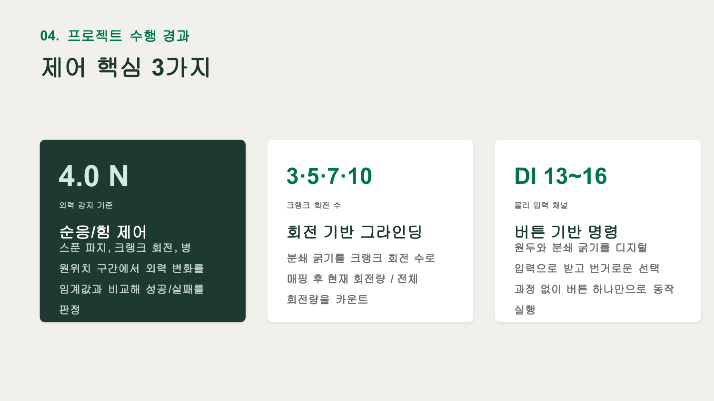
</p>

* **4.0 N — 순응 / 힘 제어**: 스푼 파지, 크랭크 회전, 병 원위치 구간에서 외력 변화를 임계값과 비교해 성공/실패 판정 (`coffee/robot.py`의 외력 헬퍼)
* **3·5·7·10 — 회전 기반 그라인딩**: 분쇄 굵기를 크랭크 회전 수로 매핑(1회전 = `movec` 360°) 후 현재/전체 회전량 카운트 (`stages/grinder.py`)
* **DI 13~16 — 버튼 기반 명령**: 원두 종류(에티오피아·콜롬비아·브라질·과테말라)와 분쇄 굵기를 물리 버튼 하나로 선택 (`coffee/buttons.py`)

### 1-3. 나선 드립 궤적 생성 (핵심 기술)

> 궤적 계산에 쓰는 순수 수학 함수는 전부 **`coffee/geometry.py`** 로 분리되어 있습니다
> (ZYZ ↔ 회전행렬 변환, 회전벡터 변환, 5차 smoothstep, 등호길이 재표본화 보조 함수 등).
> ROS·로봇 의존이 전혀 없어 로봇 없이 단독 검증이 가능합니다.

<p align="center">
  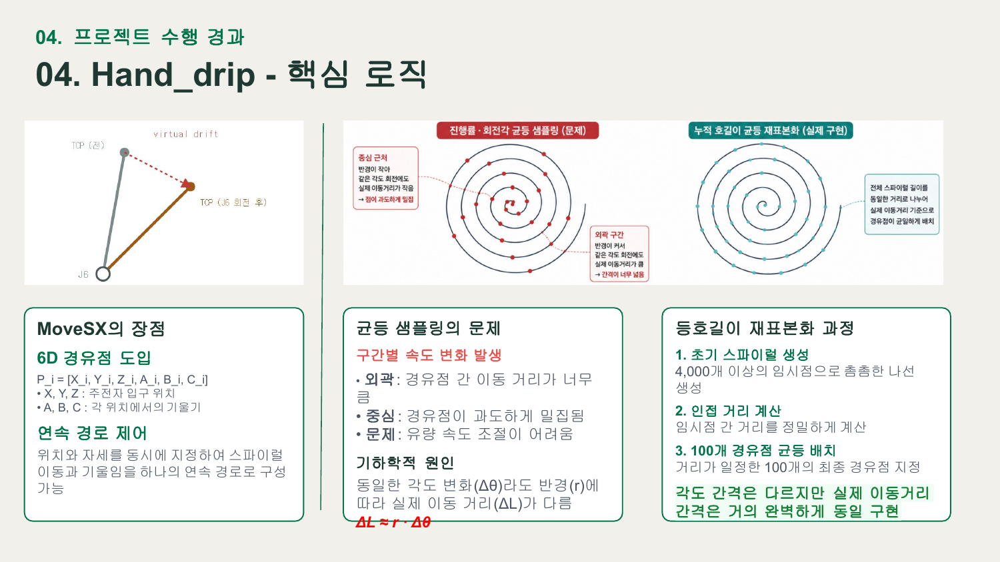
</p>

* Doosan 내장 `move_spiral()`은 **자세(A, B, C) 파라미터가 없어** "나선 이동 + 주전자 기울임"을 하나로 표현할 수 없음 → 곡선 명령 개념을 원천 제거
* 위치는 **삼각함수**로, 자세는 **회전행렬**로 직접 계산해 6D 경유점 `P_i = [X, Y, Z, A, B, C]` 생성 → `movesx` 단일 연속 경로로 실행
* **등호길이 재표본화**: 4,000개 임시점 → 인접 거리 누적 → 이동거리 등간격 100개 경유점 재배치 (각도 간격은 다르지만 실제 이동거리는 균일 → 유량 일정)

<p align="center">
  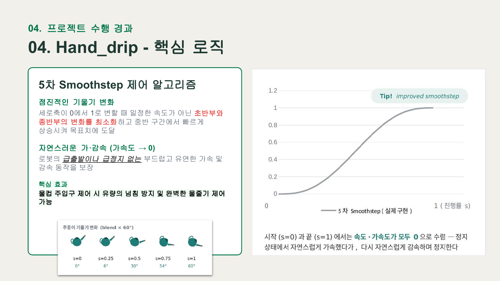
</p>

* **5차 Smoothstep** (`10u³ − 15u⁴ + 6u⁵`, `geometry._smoothstep5`)으로 기울기 blend → 시작·끝에서 속도·가속도가 모두 0으로 수렴, 급출발/급정지 없이 물줄기 제어
* 실행 전 전 구간 수치 검증(경유점 간 이동량 5 mm / 회전량 3° 이내), 실행 후 실제 TCP 이탈량 3 mm 초과 시 경고

### 1-4. 예외 처리 & Fail-Safe

**① 3단 폴백 파지 검증 (`coffee/grip_monitor.py` — `GripMonitor.verify_grip`)**

<p align="center">
  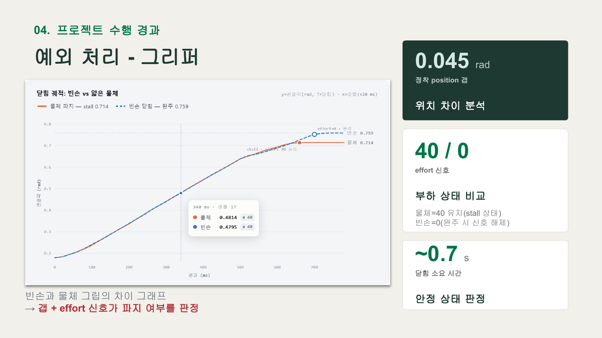
</p>

| 순위 | 신호 | 판정 |
|:---:|:---|:---|
| 최우선 | `/onrobot/grip_detected` (하드웨어 grip 비트) | Modbus로 읽은 값이 있으면 즉시 확정 |
| 차선 | `/onrobot_joint_states` → `effort` | 물체 파지 시 40 유지(stall), 빈손은 0 |
| 최후 | `/onrobot_joint_states` → `position` 갭 | 빈손 정착 0.7587 rad vs 40 N 파지 0.7141 rad, 갭 ≈ **0.045 rad**의 절반을 마진으로 사용 |

**② 그리퍼 신호 워치독 (20 Hz, fail-closed)**

<p align="center">
  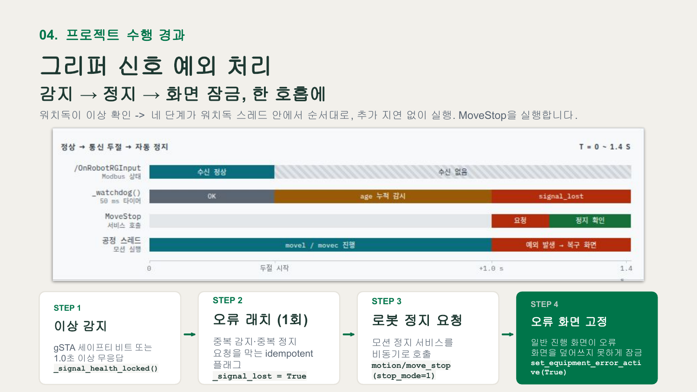
</p>

`create_timer(0.05, _watchdog)`로 50 ms마다 감시 → `/OnRobotRGInput` **1.0초 이상 미수신** 또는 **gSTA 세이프티 비트** 감지 시
`이상 감지 → 오류 래치(idempotent) → motion/move_stop(stop_mode=1) → 오류 화면 잠금` 4단계를 한 호흡에 실행

추가로 `RobotApi.guard_motion()`이 **모션 API 전체를 래핑**해, 모든 `movej`/`movel`/`movec`/`movesx` 호출의
**앞뒤에서 신호 두절 여부를 재확인**합니다. 신호가 끊긴 뒤 다음 모션 명령이 이어지는 상황을 구조적으로 차단합니다.

**③ 사이클 전체가 아니라, 실패한 단계만 재실행 (`coffee/recovery.py`)**

<p align="center">
  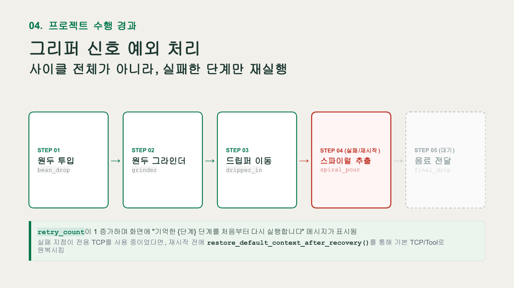
</p>

`run_protected_stage()`가 실패 단계만 처음부터 재실행하며, 전용 TCP를 쓰던 중이었다면
`restore_default_context_after_recovery()`로 기본 TCP/Tool 원복합니다.
복구 트리거가 되는 예외는 `coffee/errors.py`에 3종으로 정의되어 있습니다.

| 예외 | 발생 조건 | 복구 함수 |
|:---|:---|:---|
| `GripFailureError` | 3단 폴백 파지 검증 전부 실패 | `recover_grip_failure()` |
| `GripperSignalLostError` | 그리퍼 통신 두절 / gSTA 세이프티 비트 | `recover_gripper_signal()` |
| `ButtonWaitCancelled` | 버튼 대기 중 웹 명령으로 취소 | 디스패처가 대기 루프 종료 |

**④ 그 외 방어 로직**

| 예외 | 대응 | 위치 |
|:---|:---|:---|
| AUTO 모드에서 `set_tcp()` 거부 | `drl/drl_start`로 인라인 DRL `set_tcp(...)` 강제 실행 후 `get_drl_state`가 PLAY를 벗어날 때까지 대기 | `coffee/robot.py` |
| DSR_ROBOT2 초기 discovery 경쟁 (무한 Hang) | 대표 서비스 `motion/move_joint` 하나를 `wait_for_service()`로 게이팅 (고정 sleep 방식 폐기) | `coffee/robot.py` — `import_dsr2()` |
| 불특정 특이점 발생 | 공정 시작 시 `set_singularity_handling(DR_AVOID)` 사전 적용 | `coffee/app.py` |
| `RobotState` 토픽 미수신 | 3초(`BUTTON_SOURCE_WAIT_SEC`) 내 미수신 시 `io/get_ctrl_box_digital_input` 폴링으로 자동 전환 | `coffee/buttons.py` |
| `movesx()` 인자 시그니처 버전 차이 | `TypeError` 포착 후 대체 인자 조합으로 재시도 | `stages/spiral_pour.py` |
| `get_current_posx()` 반환 형식 차이 | posx 단독 / `(posx, sol_space)` 두 형식 모두 파싱 | `geometry._pose6_from_dsr()` |

### 1-5. 웹 인터페이스

| 화면 | 경로 | 템플릿 | 접근 |
|:---|:---|:---|:---|
| 공정 진행 화면 | `/` | `web/templates/index.html` | 공개 |
| 단계별 테스트 | `/test` | `web/templates/test.html` | 로봇 PC(127.0.0.1) 전용 |
| 관리자 대시보드 | `/admin` | `web/templates/admin.html` | 로봇 PC(127.0.0.1) 전용 |


* `/ws` WebSocket으로 **0.2초 간격 상태 변경분만 push**
* 전체 공정 속도 **10~100% 실시간 변경** (`motion/change_operation_speed`)
* 관리자 화면: 소프트 E-Stop, Jog(J1~J6 / XYZ·RxRyRz), AUTO↔MANUAL 전환, 그리퍼 수동 개폐, 이벤트 로그 스트리밍(최대 300줄)

<p align="center">
  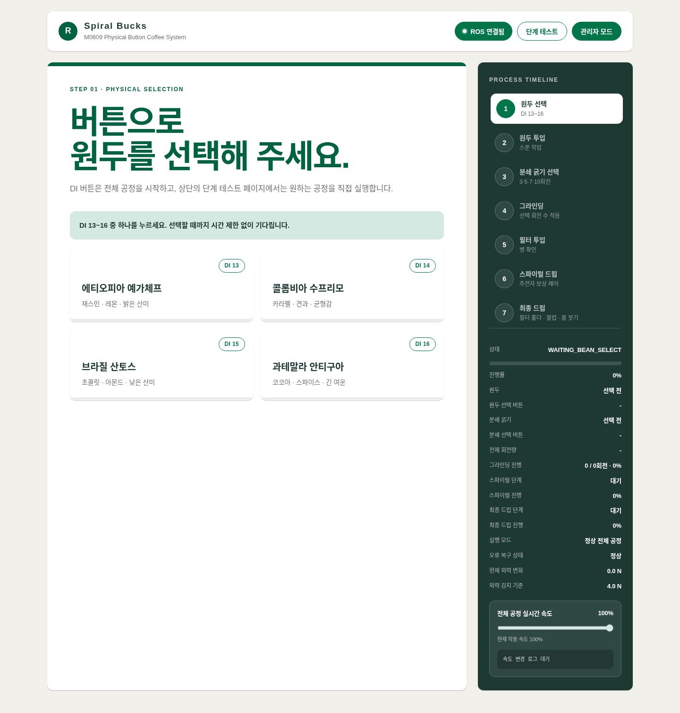
  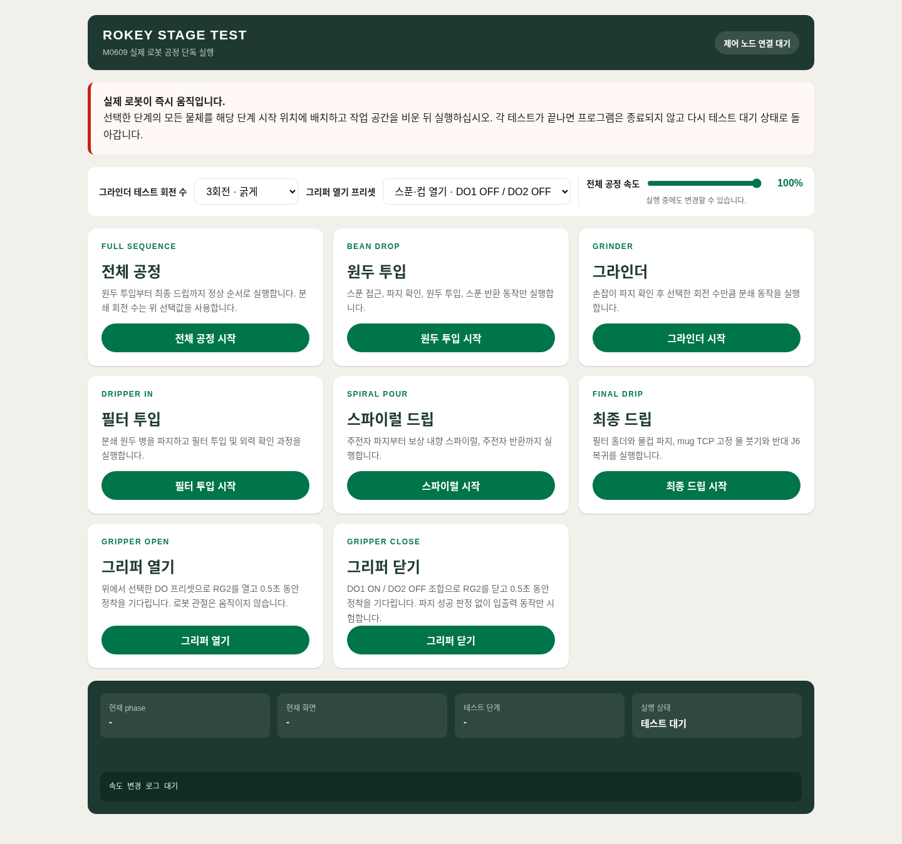
  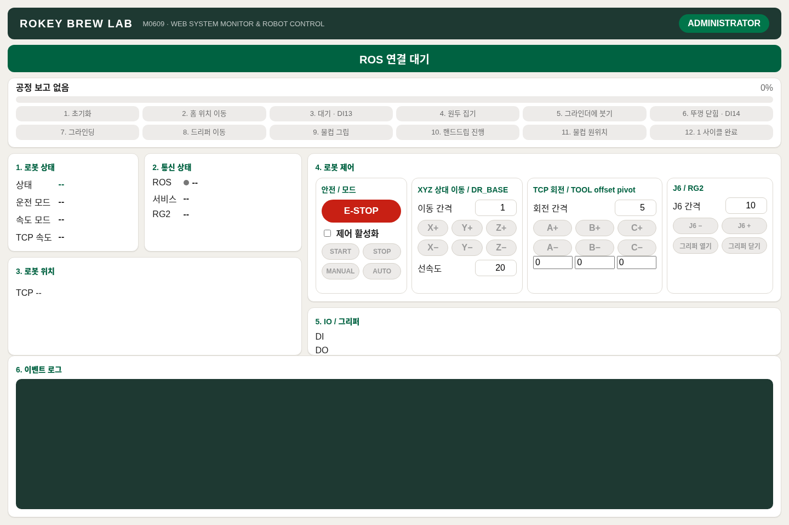
</p>

---

## 2. 🧩 모듈 구조 (Package Architecture)

### 2-1. 분리 기준 3가지

1. **레이어 분리** — 설정 / 순수 수학 / ROS 통신 / 로봇 제어 / 공정 로직을 각각 다른 파일로
2. **의존성 단방향** — 아래 계층은 위 계층을 절대 import하지 않음 (순환 import 원천 차단)
3. **공정 1단계 = 파일 1개** — DRL Task Writer의 Sub 프로그램 단위와 1:1 대응

### 2-2. `rokey/coffee/` — 로봇 제어 (14개 모듈)

| 계층 | 모듈 | 역할 | 라인 |
|:---:|:---|:---|---:|
| **L0**<br>무의존 | `config.py` | 전역 설정값과 상수 테이블 (교시 좌표, 속도, 임계값, 토픽명) | 250 |
| | `geometry.py` | 자세/경로 계산 순수 수학 (ZYZ↔회전행렬, 회전벡터, smoothstep) | 257 |
| | `errors.py` | 단계 재시작을 유발하는 예외 3종 | 40 |
| **L1**<br>단일 관심사 | `speed.py` | 작동 속도 비율 → 표시용 유효값 환산 | 54 |
| | `status.py` | Web UI가 구독할 JSON 상태 발행기 (`StatusReporter`) | 294 |
| | `buttons.py` | DI 13~16 물리 버튼 입력 (`PhysicalButtonInput`) | 332 |
| | `grip_monitor.py` | RG2 그립 판정 + 통신/안전 워치독 (`GripMonitor`) | 457 |
| | `control_bridge.py` | 웹 테스트/속도 명령 중계 ROS 노드 (`CoffeeControlBridge`) | 264 |
| **L2**<br>실행 컨텍스트 | `robot.py` | `RobotApi` / `TeachPoses` / `RobotContext` + 그리퍼·TCP·외력 헬퍼 | 495 |
| **L3**<br>공정 | `stages/bean_drop.py` | ① 원두 투입 | 82 |
| | `stages/grinder.py` | ② 분쇄 + 실시간 회전 진행률 | 250 |
| | `stages/dripper_in.py` | ③ 필터 투입 + 외력 두드림 감지 | 126 |
| | `stages/spiral_pour.py` | ④ 보정 스파이럴 드립 | 650 |
| | `stages/final_drip.py` | ⑤ mug TCP 고정 물 붓기 | 734 |
| **L4**<br>흐름 | `recovery.py` | 그립/장비 오류 복구 흐름, `run_protected_stage()` | 414 |
| | `app.py` | 공정 디스패처, 웹 테스트 실행, `main()` | 454 |

**의존 방향** (화살표가 import 방향, 역방향은 존재하지 않음)

```
config ──┬──> speed ──> control_bridge ──┐
         ├──> status ────────────────────┤
         ├──> buttons ───────────────────┼──> robot ──> stages ──┐
         ├──> grip_monitor ──────────────┤       ▲               ├──> app
errors ──┴──> recovery ─────────────────┴───────┘               │
                  └──────────────────────────────────────────────┘
geometry ──> stages   (ROS/로봇 의존 0 — 단독 테스트 가능)
```

### 2-3. `rokey/web/` — 웹 UI (4개 모듈 + 템플릿 3종)

| 모듈 | 역할 | 라인 |
|:---|:---|---:|
| `constants.py` | 토픽 이름, 허용값 화이트리스트, 기본 상태 스냅샷 | 93 |
| `bridge.py` | 상태 수집·명령 발행 ROS 노드 (`CoffeeWebBridge`) | 93 |
| `pages.py` | `templates/*.html` 로더 (`lru_cache`) | 18 |
| `app.py` | FastAPI 앱, 라우트, lifespan, `main()` | 247 |
| `templates/index.html` | 공정 진행 화면 | 997 |
| `templates/test.html` | 단계별 테스트 화면 | 161 |
| `templates/admin.html` | 관리자 대시보드 | 44 |

`app.py`의 **lifespan**에서 `CoffeeWebBridge`와 `SystemMonitor` 두 노드를 `MultiThreadedExecutor(num_threads=4)`에 함께 올려
별도 스레드로 spin하고, 종료 시 executor shutdown → node destroy → `rclpy.shutdown()` 순으로 정리합니다.

> ⚠️ 템플릿은 `setup.py`의 `package_data={'rokey.web': ['templates/*.html']}` 로 설치됩니다.
> 이 항목이 빠지면 빌드는 성공하지만 실행 시 `FileNotFoundError`가 납니다.

### 2-4. `rokey/monitor_pjt/` — 상태 모니터 (3개 모듈)

| 모듈 | 역할 | 라인 |
|:---|:---|---:|
| `system_monitor.py` | `dsr_msgs2`/DRL 토픽·서비스를 만지는 유일한 노드. 10 Hz 스냅샷 발행 + 수동 제어 중계 | 726 |
| `snapshot.py` | `~/status` JSON 스키마 dataclass. `dataclasses`만 의존 (로봇 SDK 없는 PC에서도 import 가능) | 60 |
| `process_state.py` | 공정 상태머신(`STEP`) 정의와 `/coffee_process/state` 보고 규약 (`ProcessReporter`) | 216 |

`snapshot.py`가 직렬화 스키마 역할을 하므로, 발행 측이 `asdict(snapshot)`으로 보내고 구독 측이
`Snapshot(**json.loads(...))`으로 복원합니다. **필드 이름이 어긋나면 그 자리에서 `TypeError`로 즉시 드러납니다.**

### 2-5. 진입점 shim

`rokey/coffee_system.py`(27줄)와 `rokey/web_ui.py`(24줄)는 **`main()`만 재수출**합니다.

```python
# rokey/coffee_system.py
from .coffee.app import main
__all__ = ["main"]
```

---

## 3. 🎨 시스템 설계 및 플로우 차트

### 3-1. 시스템 설계도 (System Architecture)

<p align="center">
  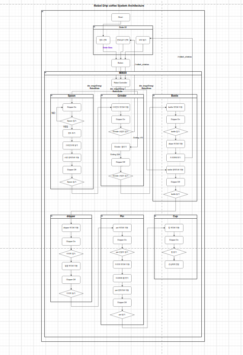
</p>

* *설명: Order UI → Robot Controller → Spoon / Grinder / Bottle / dripper / Pot / Cup 서브루틴별 상세 상태 전이도입니다. 각 서브루틴은 `Gripper On/Off`와 파지 검증 분기를 포함하며, 현재 코드에서는 `stages/` 아래 파일 하나에 각각 대응합니다.*

<p align="center">
  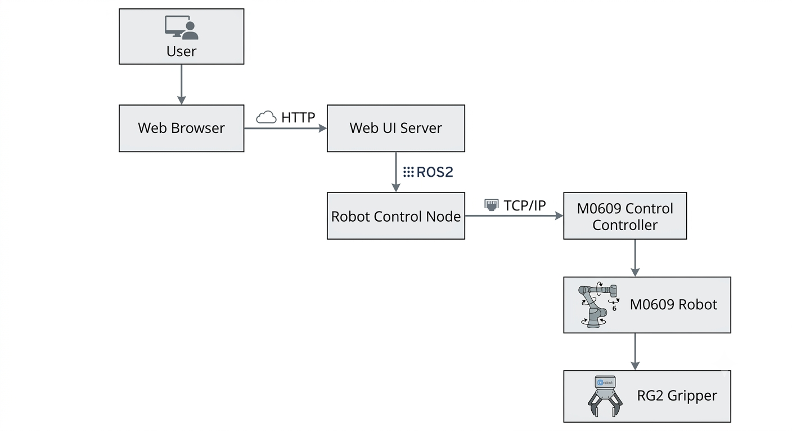
</p>

* *설명: 사용자는 브라우저에서 **HTTP**로 FastAPI Web UI Server에 접속합니다. Web UI Server는 **ROS2 토픽**(`/coffee_system/status`, `/coffee_system/control`)으로 Robot Control Node와 통신하고, Robot Control Node는 `dsr_controller2`를 통해 **TCP/IP**로 M0609 컨트롤러에 모션 서비스를 호출합니다. RG2 그리퍼는 컨트롤 박스 DO 1·2 접점 조합과 Modbus TCP 상태 신호로 제어·감시됩니다.*

### 3-2. 플로우 차트 (Flow Chart)

<p align="center">
  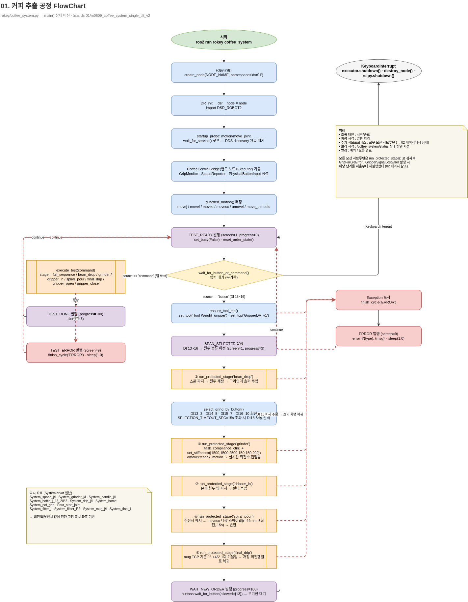
</p>

* *설명: `coffee/app.py` — `main()` 상태 머신 (노드 `dsr01/m0609_coffee_system_single_tilt_v2`)의 코드 레벨 흐름도입니다.*

**① 기동 시퀀스 (파랑)**
`rclpy.init()` → `create_node(namespace='dsr01')` → `DR_init.__dsr__node = node` 설정 후 `DSR_ROBOT2` import →
`motion/move_joint` `wait_for_service()` 루프로 **DDS discovery 완료 대기** → `CoffeeControlBridge`(별도 노드+Executor) 기동 및
`GripMonitor` · `StatusReporter` · `PhysicalButtonInput` 생성 → `guarded_motion()`으로 `movej`/`movel`/`movec`/`movesx`/`amovel`/`move_periodic` 래핑.

**② 입력 대기 분기**
`TEST_READY` 발행(`set_busy(False)` · `reset_order_state()`) 후 `wait_for_button_or_command()`가 두 입력원을 동시에 기다립니다.

| 입력원 | 경로 |
|:---|:---|
| `source == 'command'` (웹 `/test`) | `execute_test(command)` → `full_sequence` / `bean_drop` / `grinder` / `dripper_in` / `spiral_pour` / `final_drip` / `gripper_open` / `gripper_close` 중 1개 실행 → 정상이면 `TEST_DONE`(progress=100), 예외면 `TEST_ERROR`(screen=9) → `TEST_READY` 복귀 |
| `source == 'button'` (DI 13~16) | `ensure_tool_tcp()`로 `Tool Weight_gripper` / `GripperDA_v1` 확정 → `BEAN_SELECTED` 발행(원두 종류 확정) → 본 공정 진입 |

**③ 본 공정 (주황 = 로봇 모션 서브루틴)**
① `bean_drop` → `select_grind_by_button()`(DI13=3 · DI14=5 · DI15=7 · DI16=10 회전, `SELECTION_TIMEOUT_SEC=15s` 초과 시 DI13 자동 선택) →
② `grinder`(`task_compliance_ctrl` + `set_stiffnessx([1500,1500,2500,150,150,200])`, `amovec`/`check_motion`으로 실시간 회전수 진행률) →
③ `dripper_in` → ④ `spiral_pour`(`movesx` 내향 스파이럴 r=44 mm, 5회전, 15 s) → ⑤ `final_drip`(mug TCP 기준 J6 기울임 → 저장 회전행렬로 복귀) →
`WAIT_NEW_ORDER` 발행(progress=100) 후 `buttons.wait_for_button(allowed={13})`으로 무기한 대기, DI 13 입력 시 초기 화면 복귀.

**④ 예외 경로 (빨강 점선)**
5개 단계는 모두 `run_protected_stage()`로 감싸져 있어 `GripFailureError` / `GripperSignalLostError` 발생 시
**해당 단계만 처음부터 재실행**합니다. 복구 불가 예외는 상위에서 포착해 `finish_cycle('ERROR')` → `ERROR` 발행(screen=9, `error=f'{type}: {msg}'`) 후 `TEST_READY`로 돌아갑니다.
`KeyboardInterrupt`는 `executor.shutdown()` → `destroy_node()` → `rclpy.shutdown()` 순으로 정리합니다.

**⑤ 색상 범례**

| 색 | 의미 |
|:---|:---|
| 초록 타원 | 시작 / 종료 |
| 파랑 사각 | 일반 처리 |
| 주황 사각 | 로봇 모션 서브루틴 |
| 보라 사각 | `/coffee_system/status` 상태 발행 지점 |
| 빨강 | 예외 / 오류 경로 |

> 교시 좌표는 `System.drvar` 원본 기준(`System_spoon_j/l`, `System_grinder_j/l`, `System_handle_j/l`, `System_bottle_j_1/j_2/l/l2`,
> `System_drip_j/l`, `System_home`, `System_pot_grip`, `Pour_start_joint`, `System_fitter_j`, `System_filtter_l/l2`, `System_mug_j/l`, `System_final_l`)이며,
> **비전/외부 센서 없이 전량 고정 교시 좌표 기반**으로 동작합니다 .

### 3-3. 워크스페이스 배치도 (Workcell Layout)

<p align="center">
  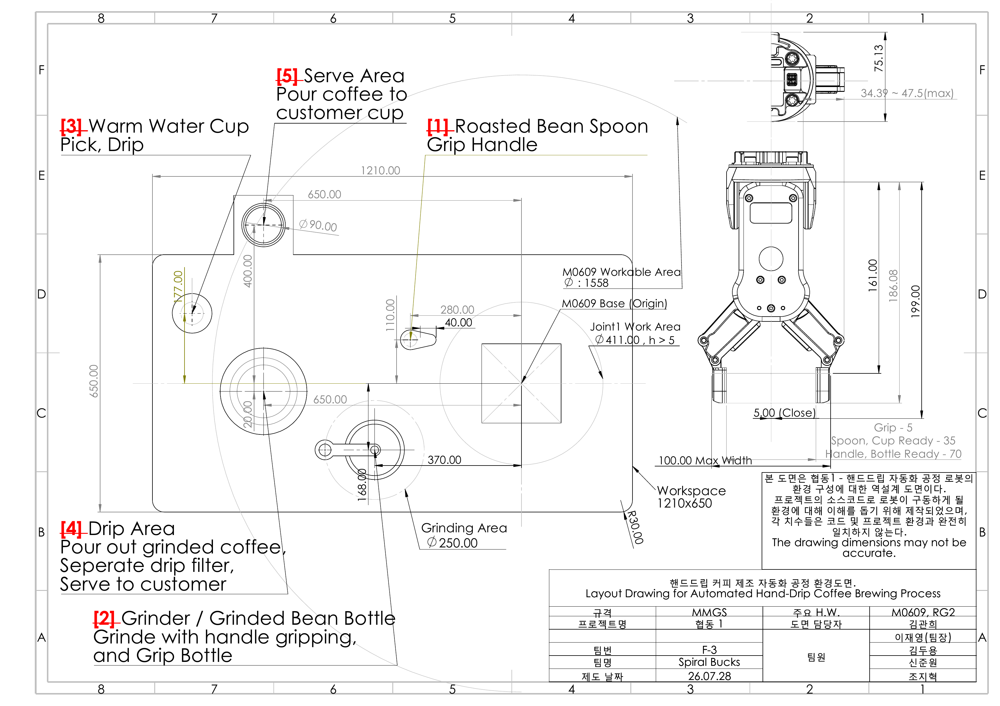
</p>

* *설명: 1210 × 650 mm 작업대 위 5개 구역 — **[1]** Roasted Bean Spoon, **[2]** Grinder / Grinded Bean Bottle(Ø250 Grinding Area), **[3]** Warm Water Cup, **[4]** Drip Area, **[5]** Serve Area. M0609 가동 반경 Ø1558, Joint1 간섭 영역 Ø411. RG2 그리퍼 폭은 Grip 5 mm / Spoon·Cup Ready 35 mm / Handle·Bottle Ready 70 mm로 운용합니다. (역설계 도면이므로 치수는 실제 코드값과 완전히 일치하지 않습니다.)*

<p align="center">
  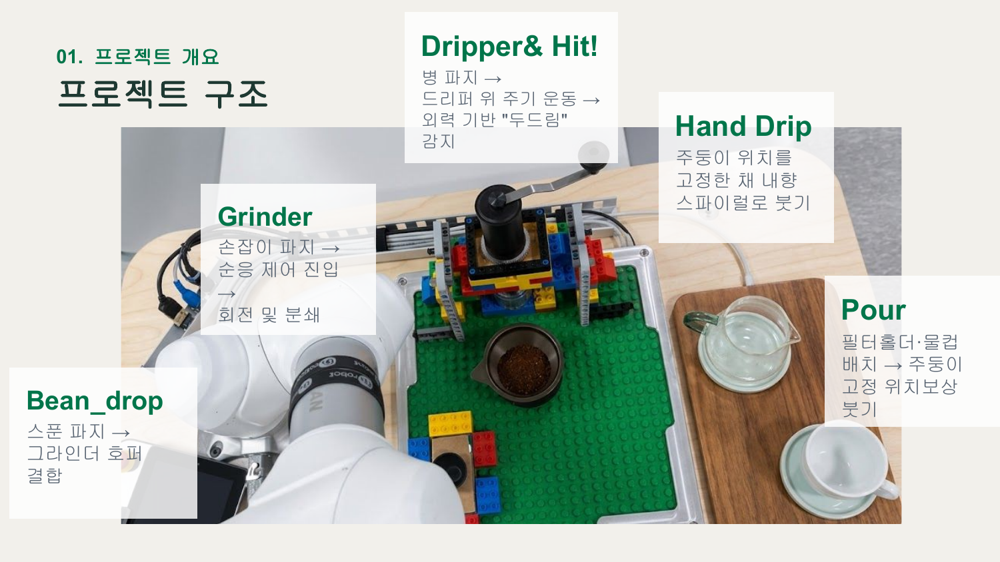
</p>

---

## 4. 🖥️ 운영체제 환경 (OS Environment)

| 항목 | 버전 |
|:---|:---|
| **OS** | Ubuntu 22.04 LTS |
| **ROS Version** | ROS 2 Humble Hawksbill |
| **Language** | Python 3.10.12 |
| **Web Framework** | FastAPI + Uvicorn (ASGI) |
| **로봇 제어** | DRL (Doosan Robot Language) / `DSR_ROBOT2` Python API |
| **로봇 드라이버** | `doosan-robot2` (dsr_controller2) |
| **그리퍼 드라이버** | `onrobot-ros2` (Modbus TCP) |
| **IDE** | VS Code |
| **네트워크** | 로봇 `192.168.1.100` · 그리퍼 컴퓨트박스 `192.168.1.1` · Web UI `0.0.0.0:8000` |

---

## 5. 🛠️ 사용 장비 목록 (Hardware List)

| 장비명 (Model) | 수량 | 비고 |
|:---|:---:|:---|
| **Doosan M0609** 협동로봇 | 1 | 6 DOF, 가반하중 6 kg, 작업반경 900 mm |
| **OnRobot RG2** 그리퍼 | 1 | 최대 개폐폭 100 mm, 파지력 40 N, Modbus TCP |
| **Laptop (제어 PC)** | 1 | Ubuntu 22.04, ROS2 Humble, FastAPI 서버 호스팅 |
| **Teaching Pendant** | 1 | 교시 좌표(`System.drvar`) 취득, Tool/TCP 프리셋 등록 |
| **아날로그 버튼** | 4 | 컨트롤 박스 **DI 13~16** — 원두 선택 / 분쇄 굵기 선택 / 관리자 호출 / 재시작 승인 |
| **Lego 블록 지그** | 1 set | 그라인더·드리퍼·병 고정 지그 (반복 정밀도 확보) |
| **주전자 (Pot)** | 1 | 나선 드립용, 전용 TCP `pot` 등록 |
| **Spoon** | 1 | 원두 계량용, 전용 파지 프리셋(35 mm) |
| **Grinder** | 1 | 수동 크랭크형, 회전 수로 분쇄 굵기 제어 |
| **Mug (물컵)** | 1 | 서빙용, 전용 TCP `mug`(컵 입구 끝점) 등록 |
| 드리퍼 / 필터 홀더 | 1 | 추출부 |
| 분쇄 원두 Bottle | 1 | 그라인더 하단 수거통 겸 이송 용기 |

---

## 6. 📦 의존성 (Dependencies)

### 6-1. 시스템 패키지 (APT)

```bash
sudo apt update
sudo apt install libpoco-dev

# ROS2 빌드 및 실행
sudo apt install ros-humble-joint-state-publisher-gui \
    ros-humble-xacro \
    ros-humble-gazebo-ros-pkgs

# 제어 및 하드웨어 인터페이스
sudo apt install ros-humble-hardware-interface \
    ros-humble-ros2-control \
    ros-humble-ros2-controllers
```

### 6-2. Python 패키지 — `requirements.txt`

```txt
# --- Web UI / API 서버 (rokey/web/) ---
fastapi>=0.110.0
uvicorn[standard]>=0.27.0
websockets>=12.0

# --- 궤적 연산 · 회전행렬 수학 (rokey/coffee/geometry.py) ---
numpy>=1.21.5

# --- OnRobot RG2 Modbus TCP 드라이버 ---
pymodbus==3.6.9

# --- (선택) 궤적 검증 · 디버깅 플롯 ---
matplotlib>=3.5.1
```

```bash
pip3 install -r requirements.txt
```

> `pymodbus`는 `onrobot_rg_control/setup.py` 기준 `3.6.9`입니다.
> 워크스페이스 초기 안내 문서에는 `3.3.2`로 되어 있어, 드라이버 실행 중 Modbus 오류가 나면 두 버전을 교차 확인하세요.

### 6-3. ROS 2 패키지 의존 (`package.xml`)

| 구분 | 패키지 |
|:---|:---|
| 필수 | `rclpy`, `std_msgs`, `sensor_msgs`, `action_msgs` |
| 로봇 | `dsr_msgs2`, `dsr_common2` (`doosan-robot2`) |
| 그리퍼 | `onrobot_rg_msgs` (`onrobot-ros2`) |
| 실행 의존 | `python3-numpy`, `python3-matplotlib`, `python3-tk` |

```bash
cd ~/ws_cobot_pjt/ws_dsr
rosdep install -r --from-paths src --ignore-src --rosdistro $ROS_DISTRO -y
```

---

## 7. ▶️ 실행 순서 (Usage Guide)

### Step 0. 워크스페이스 빌드 (최초 1회)

```bash
mkdir -p ~/ws_cobot_pjt/ws_dsr
cd ~/ws_cobot_pjt/ws_dsr
git clone https://github.com/wodud4143/DooSan_Robotics_Cobot_Project.git .

# ament_python 패키지 마커 (없으면 colcon build 실패)
mkdir -p src/rokey/resource && touch src/rokey/resource/rokey

rosdep install -r --from-paths src --ignore-src --rosdistro $ROS_DISTRO -y
colcon build --symlink-install
source install/setup.bash
```

**빌드 확인**

```bash
ros2 pkg executables rokey
# → rokey coffee_system
#   rokey web_ui

# 템플릿이 install 트리에 복사되었는지 확인 (없으면 /test, /admin 접속 시 FileNotFoundError)
ls install/rokey/lib/python3.10/site-packages/rokey/web/templates/
```

**Real 모드 사전 조건 — UDP 특권 포트 해제 (필수)**

```bash
sudo sysctl -w net.ipv4.ip_unprivileged_port_start=0
# 재부팅 후에도 유지
echo 'net.ipv4.ip_unprivileged_port_start=0' | sudo tee /etc/sysctl.d/99-ros2-doosan.conf
```

---

### Step 1. 로봇 + 그리퍼 브링업 (터미널 ①)

로봇 전원을 켜고 티치펜던트를 **AUTO 모드 / SERVO ON** 상태로 둔 뒤 실행합니다.
`m0609_rg2_bringup`이 `dsr_controller2`와 OnRobot RG2 드라이버(`OnRobotRGControllerServer`)를 함께 기동합니다.

```bash
source ~/ws_cobot_pjt/ws_dsr/install/setup.bash

# Real 모드 (실제 로봇)
ros2 launch m0609_rg2_bringup bringup.launch.py mode:=real host:=192.168.1.100 model:=m0609

# Virtual 모드 (시뮬레이션 — DRCF 에뮬레이터 필요)
ros2 launch m0609_rg2_bringup bringup.launch.py
```

**확인 사항** — 아래 토픽이 살아 있어야 다음 단계로 진행합니다.

```bash
ros2 topic hz /OnRobotRGInput      # 그리퍼 상태 (1.0초 이상 끊기면 워치독이 공정을 정지시킴)
ros2 topic echo /dsr01/joint_states --once
```

---

### Step 2. 메인 제어 노드 실행 (터미널 ②)

> ⚠️ **이 노드는 실행 직후 실제 로봇 모션을 수행합니다.**
> 그라인더·드리퍼·병·컵·스푼의 위치가 교시 당시(`System.drvar`)와 동일한지, 작업 공간에 사람/장애물이 없는지 반드시 확인하십시오.

```bash
source ~/ws_cobot_pjt/ws_dsr/install/setup.bash
ros2 run rokey coffee_system
```

내부적으로 `rokey/coffee/app.py`의 `main()`이 실행되며, 기동 시 `motion/move_joint` 서비스가 매칭될 때까지
`컨트롤러 서비스 연결 대기 중...` 로그를 반복 출력합니다.
이 메시지가 멈추고 `WAITING_BEAN_SELECT` 상태가 되면 정상입니다.

---

### Step 3. 웹 UI 서버 실행 (터미널 ③)

`rokey/web/app.py`의 lifespan이 `CoffeeWebBridge`와 `SystemMonitor` 노드를 동시 기동합니다.

```bash
source ~/ws_cobot_pjt/ws_dsr/install/setup.bash
ros2 run rokey web_ui
# → Uvicorn running on http://0.0.0.0:8000
```

---

### Step 4. 브라우저 접속 & 공정 시작

| 화면 | URL | 접근 제한 |
|:---|:---|:---|
| 공정 진행 화면 | `http://localhost:8000/` | 공개 (같은 네트워크의 다른 기기에서도 접속 가능) |
| 단계별 테스트 | `http://127.0.0.1:8000/test` | 로봇 PC 전용 |
| 관리자 대시보드 | `http://127.0.0.1:8000/admin` | 로봇 PC 전용 |

**정상 공정 진행 순서**

1. 화면에 `STEP 01 · 원두 선택 대기` 표시 → **물리 버튼 DI 13~16** 중 하나를 눌러 원두 선택
2. 자동으로 `bean_drop` 진행
3. `STEP 03 · 분쇄 굵기 선택 대기` → **DI 13~16**으로 굵기 선택 (3 / 5 / 7 / 10 회전, 15초 내 미입력 시 DI 13 자동 선택)
4. `grinder` → `dripper_in` 자동 진행
5. `dripper_in` 종료 시 **병을 손으로 가볍게 두드려(4 N 이상)** 완료 신호 전달
6. `spiral_pour` → `final_drip` 자동 진행 → `STEP 07 · 커피 완성`
7. 새 주문은 **DI 13**을 눌러 시작

---

### Step 5. (선택) 단계별 개별 테스트

전체 공정 대신 `/test` 페이지에서 `bean_drop` / `grinder` / `dripper_in` / `spiral_pour` / `final_drip` /
`gripper_open` / `gripper_close`를 개별 실행할 수 있습니다 (`coffee/app.py`의 `execute_test()`가 디스패치).
단계 테스트는 **해당 단계 시작 위치에 물체를 미리 배치**하고 작업 공간을 비운 뒤 실행하십시오.

---

### Step 6. (선택) 로봇 없이 모듈 단독 점검

`geometry.py`, `snapshot.py`, `process_state.py`는 로봇/ROS 의존이 없거나 최소여서 단독 실행이 가능합니다.

```bash
cd ~/ws_cobot_pjt/ws_dsr/src/rokey
python3 -m rokey.monitor_pjt.process_state --selftest
python3 -m rokey.monitor_pjt.system_monitor --selftest     # 로봇 불필요
```

---

### 종료

각 터미널에서 `Ctrl + C` (역순: Step 3 → Step 2 → Step 1).
`coffee_system`은 `KeyboardInterrupt`를 받아 executor 종료 → 노드 destroy → `rclpy.shutdown()` 순으로 정리합니다.

---

## 8. 📡 부록 — 노드 · 토픽 · 서비스 요약

### 8-1. 노드 구성

| 노드 | 모듈 | 역할 |
|:---|:---|:---|
| `dsr01/m0609_coffee_system_single_tilt_v2` | `coffee/app.py` — `main()` | 실제 공정을 순차 실행하는 로봇 제어 메인 스레드 |
| `…_web_control` | `coffee/control_bridge.py` — `CoffeeControlBridge` | 메인 스레드가 `movej`/`movel`로 블로킹된 동안에도 웹 명령을 받는 별도 노드/Executor |
| `coffee_webui_bridge` | `web/bridge.py` — `CoffeeWebBridge` | 브라우저 ↔ ROS 중계 (FastAPI 프로세스 내 rclpy 노드) |
| `system_monitor` | `monitor_pjt/system_monitor.py` — `SystemMonitor` | 관리자 화면 전용. 10 Hz 로봇 상태 스냅샷 발행 + 수동 제어 중계 |
| `dsr_controller2` | `doosan-robot2` (외부) | 모든 `motion/*`, `force/*`, `io/*`, `tcp/*`, `tool/*`, `drl/*`, `system/*`, `aux_control/*` 서비스 서버 |
| `OnRobotRGControllerServer` | `onrobot-ros2` (외부) | RG2 Modbus TCP 드라이버, gSTA 상태 발행 |

### 8-2. 주요 토픽

| 토픽 | 타입 | 발행 → 구독 | 정의 위치 |
|:---|:---|:---|:---|
| `/coffee_system/status` | `std_msgs/String` (JSON) | 로봇 노드 → 웹 UI | `coffee/status.py`, `web/constants.py` |
| `/coffee_system/control` | `std_msgs/String` (JSON) | 웹 UI → 로봇 노드 | `coffee/control_bridge.py` (`start_test`, `set_speed`) |
| `/system_monitor/status` | `std_msgs/String` (JSON) | monitor → 웹 UI | `monitor_pjt/snapshot.py` 스키마, 10 Hz |
| `/system_monitor/log` | `std_msgs/String` | monitor → 웹 UI | 이벤트/오류 로그 스트림 (최대 300줄) |
| `/system_monitor/cmd` | `std_msgs/String` (JSON) | 웹 UI → monitor | `estop`, `stop`, `start`, `set_mode`, `move_task`, `move_joint6`, `gripper` |
| `/coffee_process/state` | `std_msgs/String` (JSON) | 공정 → monitor | `monitor_pjt/process_state.py` (TRANSIENT_LOCAL) |
| `/dsr01/msg/robot_state` 외 2종 | `dsr_msgs2/msg/RobotState` | 컨트롤러 → 로봇 노드 | `coffee/buttons.py` — DI 13~16 비트마스크 |
| `/OnRobotRGInput` | `onrobot_rg_msgs/OnRobotRGInput` | RG2 드라이버 → 로봇 노드 | `coffee/grip_monitor.py` — gSTA 권위 신호 |
| `/onrobot/grip_detected` | `std_msgs/Bool` | 외부 → 로봇 노드 | `coffee/grip_monitor.py` — 파지 1순위 |
| `/onrobot_joint_states` | `sensor_msgs/JointState` | 외부 → 로봇 노드 | `coffee/grip_monitor.py` — effort/position 보조 판정 |

### 8-3. 주요 서비스 (전부 `dsr_controller2`가 서버)

| 분류 | 서비스 | 용도 | 호출 모듈 |
|:---|:---|:---|:---|
| 탐색 | `motion/move_joint` | 기동 시 discovery 게이팅 | `coffee/robot.py` |
| 모션 | `motion/move_joint`, `move_line`, `move_circle`, `move_spline_task`, `move_periodic` | 관절/직선/원호/스플라인/주기 모션 | `coffee/stages/*` |
| 모션 | `motion/check_motion` | 그라인더 원호 진행 0.1 s 폴링 → 회전 진행률 | `stages/grinder.py` |
| 모션 | `motion/change_operation_speed` | 전체 공정 속도 10~100 % 실시간 변경 | `coffee/control_bridge.py` |
| 모션 | `motion/move_stop` | 신호 단절 시 즉시 정지 / 관리자 E-Stop | `coffee/grip_monitor.py` |
| 모션 | `motion/set_singularity_handling` | `DR_AVOID` 특이점 자동 회피 | `coffee/app.py` |
| 모션 | `motion/jog`, `motion/fkin` | 관리자 조그, 순기구학 | `monitor_pjt/system_monitor.py` |
| 힘 제어 | `force/task_compliance_ctrl`, `release_compliance_ctrl`, `set_stiffnessx` | 그라인더 순응 제어 (`[1500,1500,2500,150,150,200]`) | `stages/grinder.py` |
| I/O | `io/set_ctrl_box_digital_output` | **DO 1·2 조합으로 RG2 그립/열기 제어** | `coffee/robot.py` |
| I/O | `io/get_ctrl_box_digital_input` | DI 13~16 폴백 폴링 | `coffee/buttons.py` |
| 조회 | `aux_control/get_current_posx`, `get_current_posj`, `get_current_velx`, `get_tool_force` | 자세·속도·외력 조회 | `coffee/robot.py`, `stages/*` |
| TCP/Tool | `tcp/set_current_tcp`, `get_current_tcp`, `tool/set_current_tool`, `get_current_tool` | `GripperDA_v1` ↔ `pot` ↔ `mug` 전환 | `coffee/robot.py` |
| DRL | `drl/drl_start`, `drl/get_drl_state` | AUTO 모드 `set_tcp` 거부 시 폴백 | `coffee/robot.py` |
| 시스템 | `system/get_robot_system`, `get_robot_state`, `get_robot_mode`, `set_robot_mode`, `set_robot_control` | 상태 조회 및 관리자 제어 | `monitor_pjt/system_monitor.py` |
| 그리퍼 | `/onrobot/sendCommand` | 관리자 화면 수동 개폐 전용 (공정은 DO 1·2 사용) | `monitor_pjt/system_monitor.py` |

---

## 9. 📂 디렉터리 구조

```
DooSan_Robotics_Cobot_Project/          # = 워크스페이스 루트 (~/ws_cobot_pjt/ws_dsr)
├── README.md
├── requirements.txt
├── images/                             # README 이미지
└── src/
    ├── rokey/                          # ★ 본 프로젝트 패키지 (ament_python)
    │   ├── package.xml
    │   ├── setup.py                    # console_scripts + web/templates package_data
    │   ├── setup.cfg
    │   └── rokey/
    │       ├── coffee_system.py        # 진입점 shim → coffee.app:main
    │       ├── web_ui.py               # 진입점 shim → web.app:main
    │       │
    │       ├── coffee/                 # ★ 로봇 제어 (공정 5단계 + 예외 복구)
    │       │   ├── config.py           # L0 전역 설정값·상수 테이블
    │       │   ├── geometry.py         # L0 자세/경로 순수 수학 (ROS 의존 0)
    │       │   ├── errors.py           # L0 단계 재시작 예외 3종
    │       │   ├── speed.py            # L1 작동 속도 비율 환산
    │       │   ├── status.py           # L1 Web UI JSON 상태 발행
    │       │   ├── buttons.py          # L1 DI 13~16 물리 버튼 입력
    │       │   ├── grip_monitor.py     # L1 RG2 그립 판정 + 워치독
    │       │   ├── control_bridge.py   # L1 웹 테스트/속도 명령 중계 노드
    │       │   ├── robot.py            # L2 RobotApi / TeachPoses / RobotContext
    │       │   ├── stages/             # L3 공정 단계 (파일 1개 = 단계 1개)
    │       │   │   ├── bean_drop.py
    │       │   │   ├── grinder.py
    │       │   │   ├── dripper_in.py
    │       │   │   ├── spiral_pour.py
    │       │   │   └── final_drip.py
    │       │   ├── recovery.py         # L4 복구 흐름 / run_protected_stage()
    │       │   └── app.py              # L4 디스패처 + main()
    │       │
    │       ├── web/                    # ★ FastAPI 웹 UI · ROS 브릿지
    │       │   ├── constants.py        # 토픽명·허용값·기본 상태
    │       │   ├── bridge.py           # CoffeeWebBridge 노드
    │       │   ├── pages.py            # 템플릿 로더
    │       │   ├── app.py              # FastAPI 앱 + 라우트 + main()
    │       │   └── templates/
    │       │       ├── index.html      # 공정 진행 화면
    │       │       ├── test.html       # 단계별 테스트
    │       │       └── admin.html      # 관리자 대시보드
    │       │
    │       └── monitor_pjt/            # ★ 상태 모니터
    │           ├── system_monitor.py   # SystemMonitor 노드 (10 Hz 스냅샷)
    │           ├── snapshot.py         # ~/status JSON 스키마 dataclass
    │           └── process_state.py    # 공정 상태머신 + 보고 규약
    │
    ├── doosan-robot2/                  # Doosan ROS2 드라이버 (외부)
    ├── onrobot-ros2/                   # OnRobot RG2 드라이버 (외부)
    └── rg2/                            # m0609_rg2_bringup / m0609_rg2_moveit (외부)
```

---

## 10. 🧯 트러블슈팅

### 10-1. 빌드 · 패키징 

| 증상 | 원인 | 조치 |
|:---|:---|:---|
| `colcon build` 시 `error: can't copy 'resource/rokey'` | ament_python 패키지 마커 파일 누락 | `mkdir -p src/rokey/resource && touch src/rokey/resource/rokey` |
| `/test`, `/admin` 접속 시 `FileNotFoundError: templates/...` | `setup.py`의 `package_data`가 빠졌거나 재빌드 안 함 | `package_data={'rokey.web': ['templates/*.html']}` 확인 후 `colcon build` |
| `ImportError: attempted relative import` | 모듈을 파일 경로로 직접 실행 | `python3 rokey/web_ui.py` 대신 `ros2 run rokey web_ui` 또는 `python3 -m rokey.web_ui` |
| `ros2 run rokey coffee_system` — 실행 파일 없음 | `setup.py` `console_scripts` 미반영 | `colcon build --symlink-install` 후 `source install/setup.bash` 재실행 |
| `ModuleNotFoundError: rokey.coffee.stages` | `find_packages()`가 서브패키지를 못 찾음 | 각 디렉터리에 `__init__.py`가 있는지 확인 |

### 10-2. 실행 · 하드웨어

| 증상 | 원인 | 조치 |
|:---|:---|:---|
| `컨트롤러 서비스 연결 대기 중...` 무한 반복 | bringup 미실행 / 네임스페이스 불일치 | Step 1 확인, `ros2 service list \| grep motion/move_joint` |
| 노드 기동 직후 그대로 멈춤 (Hang) | DSR_ROBOT2 discovery 미완료 상태에서 API 호출 | 이미 `wait_for_service()` 게이팅 적용됨 (`coffee/robot.py`). 그래도 발생하면 bringup 재기동 |
| 즉시 `장비 오류: 그리퍼 상태 이상` 화면 | `/OnRobotRGInput` 2.0 s(`GRIP_SIGNAL_STARTUP_WAIT_SEC`) 내 미수신 | 그리퍼 전원·이더넷·컴퓨트박스 IP(`192.168.1.1`) 확인 |
| 파지했는데 `그리퍼 파지 실패` | grip 비트/effort/position 3단 폴백 모두 실패 | RG2 캘리브레이션, `config.py`의 `GRIP_EMPTY_CLOSED_POSITION_RAD` 재측정 |
| `set_tcp()` 후에도 TCP 미반영 | AUTO 모드 TCP 변경 거부 | DRL 폴백이 자동 동작. 티치펜던트에 `pot` / `mug` / `GripperDA_v1` 프리셋 등록 여부 확인 |
| `movesx() TypeError` | DSR_ROBOT2 버전별 인자 시그니처 차이 | 방어 로직이 대체 조합 재시도. 전부 실패 시 로그의 시그니처 확인 |
| `movel() got an unexpected keyword 'app_type'` | DRL 원본의 `app_type=DR_MV_APP_NONE`이 Python API에 없음 | 이미 `stages/` 전체에서 제거됨. 새 코드 작성 시 추가하지 말 것 |
| Real 모드 통신 실패 | UDP 특권 포트 미해제 | Step 0의 `sysctl` 설정 적용 후 재실행 |

---

## 11. 📝 자체 평가 및 향후 계획

**완성도 자체 평가: 9.5 / 10**

**모듈화로 확보한 것**
1. 공정 단계 수정 시 해당 `stages/*.py` 1개 파일만 열면 됨 (기존: 수천 줄 단일 파일)
2. `geometry.py` / `snapshot.py` / `process_state.py`는 로봇 없이 단독 검증 가능
3. 설정값이 `config.py` 한 곳에 모여 튜닝 지점이 명확해짐
4. HTML이 템플릿 파일로 분리되어 UI 수정 시 Python 재빌드 부담 감소

**보완할 점**
1. WorkSpace 확장 구성으로 충돌 여유 확보 (30 mm → 50 mm)
2. 완전 자동화를 위한 **Vision 도입 노드** 명시 필요 (현재는 고정 교시 좌표 기반, 비전 요구량 0)
3. `stages/` 단위 pytest 도입 (현재 `ctx` 주입 구조라 mock 대체가 가능해짐)
4. `/coffee_process/state` 규약이 굳으면 `String+JSON` → 전용 `.msg` 인터페이스 패키지로 승격

**팀원별 기여**

| 이름 | 역할 | 담당 업무 |
|:---:|:---:|:---|
| 이재영 | 팀장 | M0609 Process Develop, Integration Manager — 핸드드립 과정 Imitate, 내장 나선 명령의 한계를 극복한 궤적 생성·검증·실행, 기능 통합 및 패키지 모듈화 |
| 김관희 | 팀원 | ROS2 Gripper Management, Error TroubleShooting — 그리퍼 예외 상황 처리 및 정상 공정 복귀 알고리즘 |
| 김두용 | 팀원 | Pooling Process Develop — Tool 위치 데이터 MI, 곡선 이동 디버깅 및 시뮬레이션 |
| 신준원 | 팀원 | M0609 Process Develop — TCP 및 좌표계 Configuration, 로봇 Dynamics 설계 |
| 조지혁 | 팀원 | Hardware setup — 두산로봇 패키지 Structure Reorganize, 시스템 모니터 제작 |
| 이일주 | 멘토 | 아이디어 구체화, 협동로봇 기능 구현 조언, 예외처리 피드백 |

---

<p align="center">
  <b>Team SPIRAL BUCKS · COFFEE AUTOMATION</b><br>
  <i>사람이 매번 흔들리는 나선 푸어링을, 편차 없이 같은 궤적으로 반복한다.</i>
</p>