# ☕ 협동로봇 핸드드립 커피 자동화 (Robot Hand-Drip Coffee System)

> 출처: 두산로보틱스 ROKEY 부트캠프(지능형 로보틱스 엔지니어 과정) 협동-1 프로젝트, 5인 팀 프로젝트의 제출 스냅샷입니다. 제출 코드는 그대로 두고 문서만 다시 정리했습니다.

> ▶️ **[1분 시연 영상](https://youtu.be/17UW9-wpsBg)** — 이 프로젝트를 가장 빨리 파악할 수 있는 자료입니다. 참고 문서는 [더 읽을 문서](#더-읽을-문서)에 있습니다.
>
> 📄 [발표 자료(PDF, 46쪽)](https://github.com/gwanhuiGIM/Rokey_cobot1/releases/download/presentation/cobot1_presentation.pdf) — 세부 기술 발표 자료

Doosan **M0609** 협동로봇과 **OnRobot RG2** 그리퍼로 핸드드립 전 과정(원두 투입 → 분쇄 → 필터 투입 → 나선 드립 → 서빙)을 자동으로 수행하는 ROS 2 시스템입니다.
사람이 손으로 하면 매번 흔들리는 나선 푸어링을 같은 궤적으로 반복하는 것이 목표였습니다.
**비전 센서는 쓰지 않습니다.** 위치는 모두 티치펜던트로 교시한 고정 좌표(`System.drvar` 원본, `coffee/config.py`)이고, 성공·실패 판정은 힘·그리퍼 신호·통신 상태로만 합니다.

```
 물리 버튼 DI13~16 ─┐                       ┌──────────── dsr_controller2 (M0609, TCP/IP)
                    ▼                       │  motion/* force/* io/* tcp/* drl/*
 브라우저 ─HTTP/WS─► web_ui (FastAPI :8000) │
                    │  CoffeeWebBridge ─────┼─ /coffee_system/control ─► coffee_system
                    │  SystemMonitor   ◄────┼─ /coffee_system/status  ◄─  (coffee/app.py)
                    │      │                │                              │ stages/ ①~⑤
                    │      └─ /system_monitor/* (관리자 화면)              │ GripMonitor
                    │                                                      ▼
                    └──────────────── OnRobotRGControllerServer ─ /OnRobotRGInput,
                                       (RG2 Modbus TCP)             /onrobot/grip_detected,
                                                                    /onrobot_joint_states
 그리퍼 개폐 명령은 컨트롤박스 DO 1·2 접점 조합으로 내립니다(Modbus는 상태 감시 + 관리자 수동 개폐).
```

## 목차

_주제별 바로가기입니다. 본문 배치 순서와 다를 수 있습니다._

- **개요·구조**: [환경 · 장비](#환경--장비) · [저장소 구성](#저장소-구성) · [무엇을 할 수 있나](#무엇을-할-수-있나) · [시스템 구조](#시스템-구조)
- **돌려 보기**: [설치](#설치) · [실행](#실행)
- **검증·한계·참고**: [한계 · 미완성](#한계--미완성) · [더 읽을 문서](#더-읽을-문서) · [검증](#검증) · [License](#license)

## 환경 · 장비

<details>
<summary>OS · 장비 설정 · 교시 좌표</summary>

- Ubuntu 22.04, ROS 2 Humble, Python 3.10, GPU 불필요

| 장비 | 설정 |
|:---|:---|
| Doosan M0609 | 컨트롤러 `192.168.1.100`, 네임스페이스 `dsr01`. 펜던트에 Tool `Tool Weight_gripper`, TCP `GripperDA_v1`·`pot`·`mug` 프리셋 등록 필요 |
| OnRobot RG2 | 컴퓨트박스 `192.168.1.1:502`(Modbus TCP). 개폐는 컨트롤박스 DO 1·2 |
| 물리 버튼 4개 | 컨트롤박스 DI 13~16 |
| 제어 PC | 로봇·웹 서버를 한 PC에서 실행(`/test`·`/admin`이 localhost 전용이기 때문) |
| 작업 도구 | 스푼, 수동 크랭크 그라인더, 분쇄 원두 병, 드리퍼, 주전자, 머그. 레고 블록 지그로 고정 |

**교시 좌표가 곧 보정값입니다.** 그라인더·드리퍼·병·컵·스푼의 위치나 지그가 바뀌면 `coffee/config.py`의 좌표를 다시 교시해야 합니다. 그리퍼를 교체하거나 다시 캘리브레이션하면 `GRIP_EMPTY_CLOSED_POSITION_RAD`(빈손 닫힘 위치)를 다시 측정합니다.

</details>

## 저장소 구성

<details>
<summary>디렉터리 구성 · 저장소 미포함 항목</summary>

```
.
├── README.md · requirements.txt
├── docs/        # 시스템 구성도(.drawio), 통신 정의서(PDF)
├── images/      # README 이미지
└── src/
    ├── rokey/           # 이 프로젝트 패키지 (ament_python) — coffee/ · web/ · monitor_pjt/
    ├── doosan-robot2/   # Doosan ROS 2 드라이버 (upstream, BSD-3-Clause)
    ├── onrobot-ros2/    # OnRobot RG 드라이버 (upstream, MIT)
    └── rg2/             # m0609_rg2_bringup · m0609_rg2_moveit (package.xml상 Apache-2.0, 작성자 미기재)
```
저장소 미포함 항목:
1. `src/rokey/resource/rokey` 마커 파일 — 아래 설치 1)에서 직접 만듭니다.
2. 사용하지 않는 로봇 모델의 meshes/USD — `.gitignore`로 제외했습니다(m0609·m1013만 유지).

</details>

## 무엇을 할 수 있나

**핵심 기능**
- **5단계 자동 공정** — `coffee_system` 노드(`coffee/app.py`)가 `stages/*.py` 다섯 단계를 차례로 실행합니다. 각 단계는 `RobotContext` 하나만 인자로 받고 `DSR_ROBOT2`를 직접 import하지 않습니다.
- **파지 판정과 통신 워치독** — `grip_monitor.py`가 RG2 신호로 파지 성공을 판정하고, 신호가 끊기면 로봇 정지를 요청합니다.
- **단계 단위 복구** — 모든 단계는 `recovery.py`의 `run_protected_stage()`로 감싸여 있습니다. 파지 실패나 통신 두절이 나면 사이클 전체가 아니라 **실패한 단계만** 처음부터 다시 실행하고, 재시작 전에는 작업자가 물리 버튼으로 승인합니다.
- **나선 드립 궤적** — `spiral_pour.py`·`geometry.py`가 위치와 주전자 기울기를 함께 담은 6D 경유점을 만들어 `movesx` 한 번으로 실행합니다.
- **웹 UI · 관리자 화면** — `web_ui` 노드(`web/app.py`)가 공정 상태 표시, 단계별 테스트, 소프트 E-Stop·Jog를 브라우저로 제공합니다.

<p align="center">
  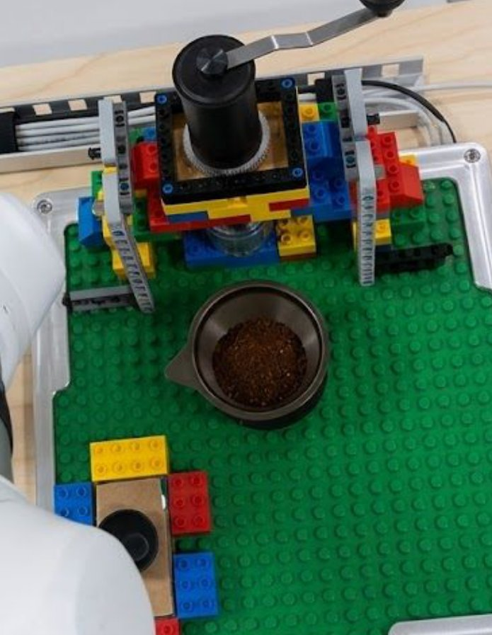
</p>

<p align="center">
  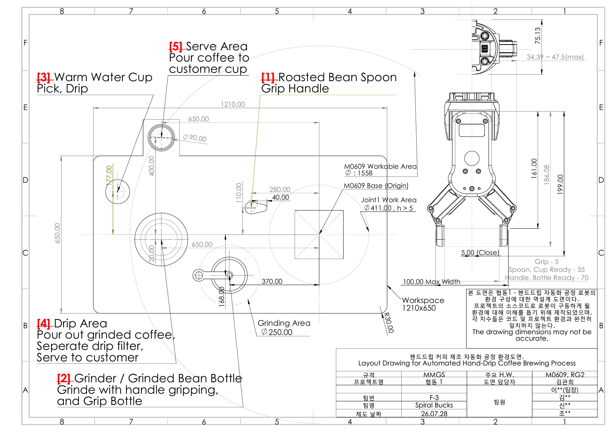
</p>

워크셀 도면은 역설계한 것이라 치수가 코드값과 정확히 같지는 않습니다.

| 사용자가 하는 일 | 시스템이 하는 일 |
|:---|:---|
| 물리 버튼 DI13~16으로 원두 선택 | ① 원두 투입 실행 후 분쇄 굵기 선택 대기 |
| DI13~16으로 분쇄 굵기 선택(3/5/7/10회전). 15초 안에 누르지 않으면 DI13 | ② 분쇄 → ③ 필터 투입 |
| 병을 손으로 가볍게 두드림(기준 대비 4 N 이상). 10초 동안 외력이 없으면 자동 진행 | 병을 제자리에 놓고 ④ 나선 드립 → ⑤ 서빙 |
| 완료 화면에서 DI13 | 처음 화면으로 복귀 |
| 브라우저 `/test`(로봇 PC 전용) | 단계 하나 또는 전체 공정, 그리퍼 개폐를 개별 실행. 단계 테스트는 앞 공정을 하지 않으므로 해당 단계 시작 위치에 물체를 미리 배치하고 작업 공간을 비운 뒤 실행 |
| 브라우저 `/admin`(로봇 PC 전용) | 소프트 E-Stop, Jog, AUTO↔MANUAL 전환, 그리퍼 수동 개폐, 이벤트 로그 |

| 단계 | 파일 | 동작 |
|:---:|:---|:---|
| ① | `stages/bean_drop.py` | 스푼 파지 → 계량 → 이동과 관절 회전을 함께 실행해 그라인더 호퍼에 투입 |
| ② | `stages/grinder.py` | 손잡이 파지 → `task_compliance_ctrl` + `set_stiffnessx` 순응 제어 → `movec`/`amovec` 원호로 크랭크 회전. `check_motion` 폴링으로 회전 진행률 표시 |
| ③ | `stages/dripper_in.py` | 분쇄 원두 병을 드리퍼 위로 → `move_periodic` 진동 → 외력(4 N) 대기 → 병 복귀 |
| ④ | `stages/spiral_pour.py` | 주전자 파지 → `pot` TCP → 6D 경유점 100개를 `movesx` 한 번으로 실행하는 내향 나선(r = 44 mm, 5회전, 15 s) |
| ⑤ | `stages/final_drip.py` | `mug` TCP를 컵 입구로 두고 J6을 55° 기울여 붓기 → 저장한 시작 자세로 복귀 |

<p align="center">
  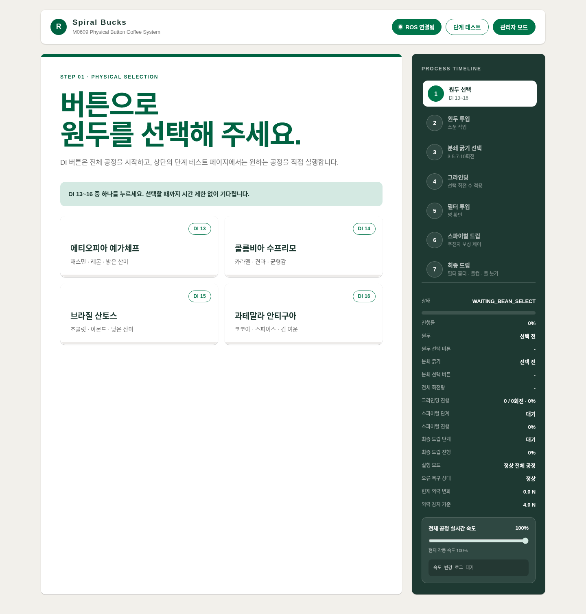
  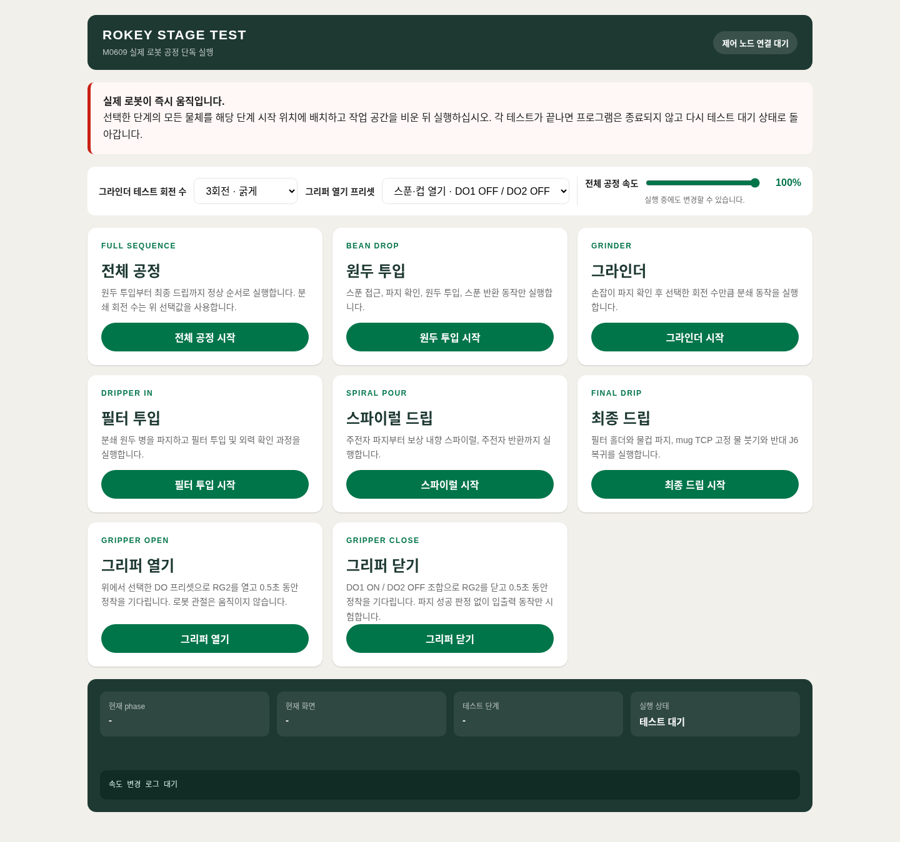
  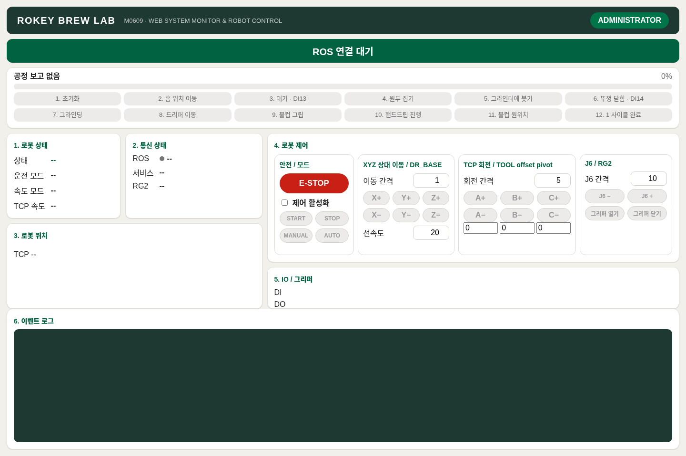
</p>

## 시스템 구조

### 공정 노드 — `coffee_system` (`rokey/coffee/`)

<details>
<summary>main() 처리 순서 · 상태 흐름도</summary>

`coffee/app.py:main()`의 처리 순서는 다음과 같습니다.
1. `dsr01` 네임스페이스에 노드 `m0609_coffee_system_single_tilt_v2`를 만듭니다.
2. `motion/move_joint`가 `wait_for_service()`로 잡힐 때까지 기다린 뒤 `DSR_ROBOT2`를 import합니다.
3. `CoffeeControlBridge`(웹 명령 수신 노드)와 `GripMonitor`를 별도 executor 스레드에서 돌립니다.
4. `set_singularity_handling(DR_AVOID)`를 적용합니다.
5. 이후 다음 루프를 반복합니다.

```
TEST_READY ──(DI13~16)──► BEAN_SELECTED ─► bean_drop ─► [굵기 선택] ─► grinder ─► dripper_in
    ▲                                                                                │
    │◄── DI13 ── WAIT_NEW_ORDER ◄── final_drip ◄── spiral_pour ◄─────────────────────┘
    │
    ├──(/test 명령)──► execute_test ─► 정상: TEST_DONE / 예외: TEST_ERROR ─► TEST_READY
    └── 복구 불가 예외 ─► ERROR(screen 9) ─► TEST_READY
```

도식에는 함수 호출과 상태 발행이 섞여 있습니다. 대문자(`TEST_READY`·`BEAN_SELECTED`·`WAIT_NEW_ORDER`·`TEST_DONE`·`TEST_ERROR`·`ERROR`)는 `/coffee_system/status` JSON의 `phase` 값입니다. 소문자(`bean_drop`…`final_drip`, `execute_test`)는 호출하는 함수입니다. 각 단계 함수도 실행 중에 자기 `phase`를 따로 발행합니다.

</details>

### 그리퍼 감시와 단계 복구 — `grip_monitor.py`, `recovery.py`

<details>
<summary>파지 판정 · 통신 워치독 · 복구 흐름 (그림 3장)</summary>

**파지 판정 (`GripMonitor.verify_grip`)** — 그리퍼를 닫은 뒤에 수신했고, 판정 시점 기준 1 s(`GRIP_SIGNAL_TIMEOUT_SEC`) 이내인 표본만 유효로 봅니다.
1. 검증 제한시간(2 s) 동안 유효한 `/onrobot/grip_detected` 비트가 true면 바로 성공입니다.
2. 제한시간이 끝난 시점에 유효 비트가 있으면 그 값으로 확정합니다. false도 최종 판정입니다.
3. 유효 비트가 없으면 유효한 `/onrobot_joint_states`로 판정합니다. `abs(effort)`가 1e-6보다 크거나, `position`이 빈손 닫힘값(0.7587 rad)보다 0.02 rad 이상 작으면 파지로 봅니다.
4. 유효 표본이 하나도 없으면 파지 실패가 아니라 **통신 두절**로 처리합니다.

<p align="center">
  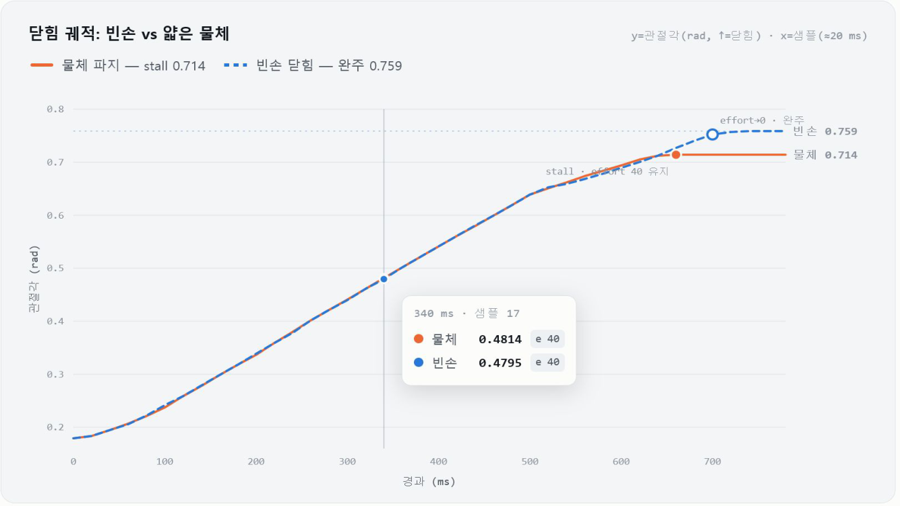
</p>

**통신 워치독** — 50 ms 타이머가 `/OnRobotRGInput`을 감시합니다. 다음 경우에 오류 래치를 걸고 `motion/move_stop`(stop_mode=1)을 요청합니다.
- 마지막 수신 후 1.0 s 초과
- gSTA 세이프티 비트가 켜짐
- 한 번도 수신하지 못함

이 감시는 **단계가 실행 중일 때만** 정지를 요청합니다. 모든 모션 API(`movej`/`movel`/`movec`/`amovec`/`movesx`/`amovel`/`move_periodic`)는 `RobotApi.guard_motion`이 호출 앞뒤에서 래치 상태를 검사합니다. 래치가 걸린 뒤의 새 모션 명령은 예외를 발생시켜 차단합니다.

<p align="center">
  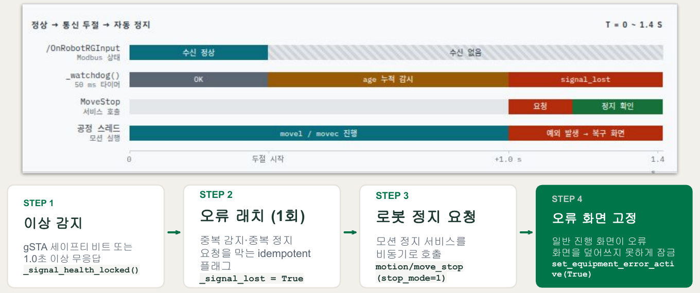
</p>

**복구 흐름 (`run_protected_stage`)** — 단계 재시도 횟수에 상한은 없습니다.

| 오류 | 복구 절차 |
|:---|:---|
| `GripFailureError` (파지 판정 false) | 오류 화면 → **DI13** 관리자 호출 → 작업 환경 정리 후 **DI14** → 기본 TCP/Tool 원복 → 같은 단계를 처음부터 |
| `GripperSignalLostError` (두절·세이프티 비트·표본 없음) | `move_stop` 응답 확인(실패하면 재요청) → 신호가 0.5 s 이상 정상 유지되는지 확인 → **DI13** 재시작 승인(대기 중 신호가 다시 나빠지면 처음으로) → 3 s 카운트다운(그사이 신호가 끊기면 취소) → 같은 단계를 처음부터 |
| 그 밖의 예외 | 단계 복구 없이 `ERROR` 화면 → `TEST_READY` |

<p align="center">
  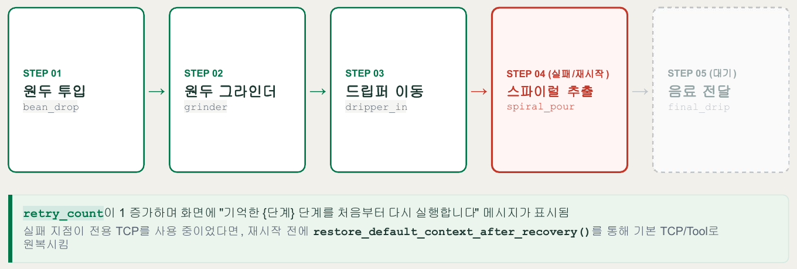
</p>

</details>

### 나선 드립 궤적 — `stages/spiral_pour.py`, `geometry.py`

<details>
<summary>경로 생성 순서 · 재표본화 그림 · 실행 장면</summary>

Doosan 내장 `move_spiral()`에는 자세(A, B, C) 인자가 없습니다. 그래서 나선 이동과 주전자 기울임을 하나의 명령으로 표현할 수 없습니다. 대신 다음 순서로 경로를 직접 만듭니다.
1. 위치는 삼각함수로, 자세는 회전행렬로 계산해 6D 경유점을 만듭니다.
2. 임시점 8,000개(`max(4000, 경유점 수 × 80)`)를 누적 이동거리 기준 등간격 100개로 재표본화합니다.
3. 기울기는 5차 smoothstep(`10u³−15u⁴+6u⁵`) 함수로 부드럽게 보간합니다.
4. 실행 전에 경유점 사이 이동량이 15 mm / 5° 이내인지 검사합니다(`MOVESX_MAX_*`).

`geometry.py`는 ROS·로봇을 import하지 않는 순수 수학 모듈입니다.

<p align="center">
  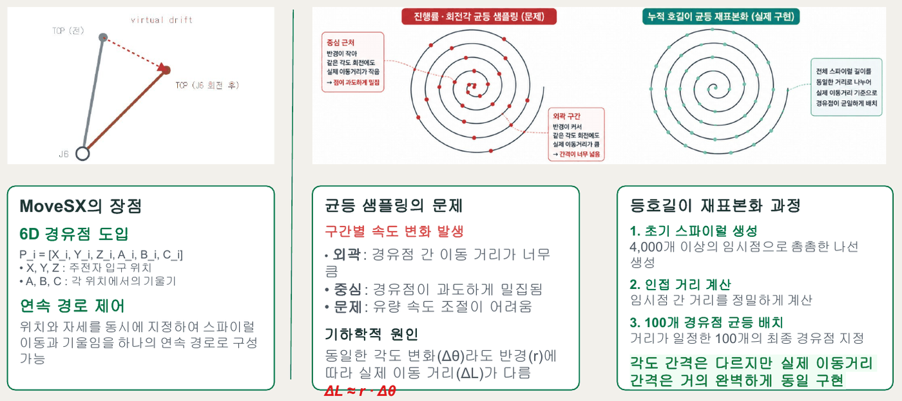
</p>

<p align="center">
  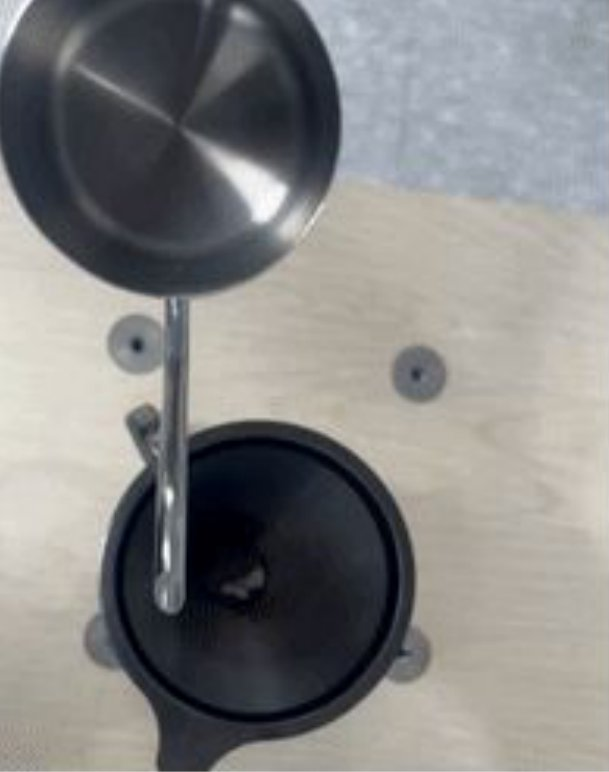
</p>

</details>

### 웹 UI와 모니터 — `web_ui` (`rokey/web/`, `rokey/monitor_pjt/`)
FastAPI 앱(`web/app.py`)이 시작될 때(`lifespan`) `CoffeeWebBridge`와 `SystemMonitor`를 `MultiThreadedExecutor`에 등록해 함께 구동합니다. 브라우저 쪽에서는 다음이 동작합니다.
- `/ws` WebSocket으로 상태 변경분을 0.2 s 간격으로 push합니다.
- 공정 속도를 10~100% 사이에서 바꿀 수 있습니다(`motion/change_operation_speed`).
- `/test`·`/admin`과 그 API는 접속 주소가 `127.0.0.1`/`::1`일 때만 허용합니다.

<details>
<summary>모듈 계층표 (<code>rokey/coffee/</code>)</summary>

| 계층 | 모듈 | 역할 | 줄 |
|:---:|:---|:---|---:|
| L0 | `config.py` | 교시 좌표·속도·임계값·토픽명 | 250 |
| | `geometry.py` | ZYZ↔회전행렬, 회전벡터, smoothstep (ROS 의존 없음) | 257 |
| | `errors.py` | 단계 재시작 예외 | 40 |
| L1 | `speed.py` | 속도 비율 → 표시값 환산 | 54 |
| | `status.py` | `/coffee_system/status` JSON 발행 (`StatusReporter`) | 294 |
| | `buttons.py` | DI13~16 입력 (`RobotState` 구독, 3 s 미수신 시 서비스 폴링으로 전환) | 332 |
| | `grip_monitor.py` | 파지 판정 + 통신/세이프티 워치독 | 457 |
| | `control_bridge.py` | 웹 테스트·속도 명령 수신 노드 | 264 |
| L2 | `robot.py` | `RobotApi`/`TeachPoses`/`RobotContext`, 그리퍼 DO·TCP·외력 헬퍼 | 495 |
| L3 | `stages/*.py` | 공정 5단계 (파일 1개 = 단계 1개) | 82~734 |
| L4 | `recovery.py` | 복구 흐름, `run_protected_stage()` | 414 |
| | `app.py` | 디스패처, `main()` | 454 |

`web/`: `constants.py`(토픽·허용값) · `bridge.py`(`CoffeeWebBridge`) · `pages.py`(템플릿 로더) · `app.py`(FastAPI) · `templates/{index,test,admin}.html`
`monitor_pjt/`: `system_monitor.py`(10 Hz 스냅샷 + 관리자 명령 중계) · `snapshot.py`(상태 JSON 스키마 dataclass) · `process_state.py`(공정 상태 보고 규약 — 아래 한계 참고)
</details>

<details>
<summary>토픽 · 서비스 요약</summary>

| 토픽 | 타입 | 방향 |
|:---|:---|:---|
| `/coffee_system/status` | `std_msgs/String`(JSON) | coffee_system → 웹 |
| `/coffee_system/control` | `std_msgs/String`(JSON) | 웹 → coffee_system (`start_test`, `set_speed`) |
| `/system_monitor/status` · `/system_monitor/log` | `std_msgs/String` | SystemMonitor → 웹 |
| `/system_monitor/cmd` | `std_msgs/String`(JSON) | 웹 → SystemMonitor (`estop`, `stop`, `start`, `set_mode`, jog, `gripper`) |
| `/dsr01/msg/robot_state` 등 | `dsr_msgs2/RobotState` | 컨트롤러 → `buttons.py` (DI 비트) |
| `/OnRobotRGInput` | `onrobot_rg_msgs/OnRobotRGInput` | RG2 드라이버 → `grip_monitor.py` (gSTA·수신 주기) |
| `/onrobot/grip_detected` | `std_msgs/Bool` | RG2 드라이버 → `grip_monitor.py` |
| `/onrobot_joint_states` | `sensor_msgs/JointState` | RG2 드라이버(remap) → `grip_monitor.py` |

| 분류 | 서비스 (`dsr_controller2`) | 쓰는 곳 |
|:---|:---|:---|
| 모션 | `motion/move_joint`·`move_line`·`move_circle`·`move_spline_task`·`move_periodic`·`check_motion` | `stages/*` |
| 모션 | `motion/move_stop` | `grip_monitor.py`, 관리자 E-Stop |
| 모션 | `motion/change_operation_speed`, `set_singularity_handling` | `control_bridge.py`, `app.py` |
| 힘 | `force/task_compliance_ctrl`·`release_compliance_ctrl`·`set_stiffnessx` | `stages/grinder.py` |
| I/O | `io/set_ctrl_box_digital_output`(DO1·2 그리퍼), `io/get_ctrl_box_digital_input` | `robot.py`, `buttons.py` |
| TCP | `tcp/*`, `tool/*`, `drl/drl_start`·`get_drl_state`(AUTO 모드에서 `set_tcp` 거부 시 DRL로 대체) | `robot.py` |
| 관리 | `system/*`, `motion/jog`, `/onrobot/sendCommand` | `system_monitor.py` |
</details>

### 저장소 밖 확장 — 힘센서 접촉 감지 (`probe_grip`)
이 저장소에는 없는 코드입니다. 개인 개발본 [`Personal_cobot1_ws` › `src/cup_detect`](https://github.com/gwanhuiGIM/Personal_cobot1_ws/tree/main/src/cup_detect)에서, 교시 좌표 대신 힘센서 접촉으로 컵 위치를 찾아 파지하는 알고리즘을 구현해 봤습니다. compliance 제어를 켜고 물체 쪽으로 다가가다가 `get_tool_force`로 읽은 반력이 임계값을 넘으면 정지하고, 그 위치를 접촉점으로 씁니다. 실기에서 접촉 감지와 정지 동작을 확인했고, 정량 기록은 남기지 않았습니다.

<details>
<summary>버전 기록 (v1 → v4)</summary>

버전마다 찌르는 축과 횟수, 파지 여부가 다릅니다(v1은 현재 소스 삭제, v4의 Y축 임계값·부호는 실측 전).

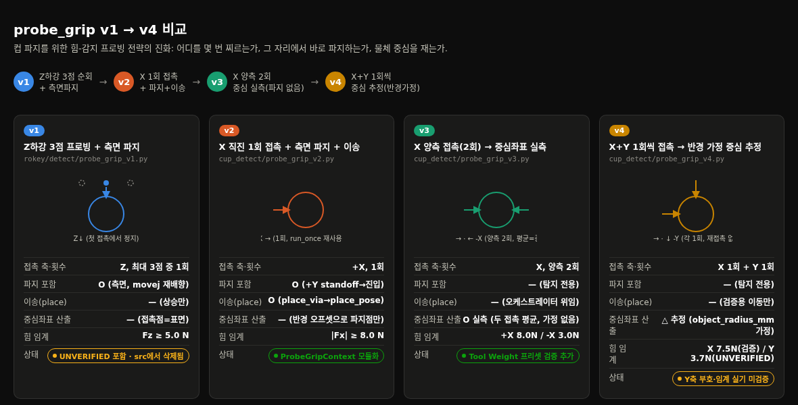

탐지 높이는 파라미터로 고정하고, v3부터는 Tool 무게 프리셋을 설정·검증해 그리퍼 자중이 외력으로 읽히는 오감지를 막습니다. 실행은 `arm:=true`를 줘야 모션이 나갑니다.
</details>

## 한계 · 미완성

- **위치는 전량 고정 교시 좌표**입니다. 도구 위치가 바뀌면 다시 교시해야 하고, 비전 보정은 없습니다.
- **`Ctrl+C`로 종료해도 로봇 정지 명령은 나가지 않고**, 단계 재시도 횟수에 상한이 없습니다(아래 실행 절의 종료 절차 참고).
- **Virtual 모드**: `gripper_virtual_node`가 `/OnRobotRGInput`을 발행하지 않으므로, 단계마다 그리퍼 신호 대기에서 장비 오류로 빠질 것으로 보입니다.
- **`/coffee_process/state`는 발행하는 노드가 없습니다.** `process_state.py`의 보고 규약·`ProcessReporter`를 `coffee_system`이 쓰지 않아, `SystemMonitor` 스냅샷의 공정 진행 필드(`snapshot.py:26`)는 채워지지 않습니다(추정).

<details>
<summary>저장소 정리 상태</summary>

- `src/rokey/resource/rokey` 마커 파일이 빠져 있습니다(설치 1) 참고).
- `__pycache__/*.pyc` 8개가 커밋돼 있습니다.
- `rokey` package.xml의 license·description이 `TODO`입니다.
- `pytest`가 없습니다.
</details>

## 더 읽을 문서

| 문서 | 내용 |
|:---|:---|
| `docs/커피 시스템 통신 정의서.pdf` | 토픽·메시지 정의 (제출 당시 문서) |
| `docs/coffee_system_architecture.drawio` | 시스템 구성도 원본 |
| `images/flow_chart.png`, `images/flow_chart_detail.png` | 제출 당시 흐름도 |

## 설치

<details>
<summary>설치 절차</summary>

```bash
# 0) 이 저장소를 clone한 디렉터리 = 워크스페이스 루트
# 1) ament_python 마커 — 저장소에 빠져 있어 없으면 colcon build가 resource/rokey 복사에서 실패
mkdir -p src/rokey/resource && touch src/rokey/resource/rokey

# 2) ROS 의존성
source /opt/ros/humble/setup.bash
rosdep install -r --from-paths src --ignore-src --rosdistro humble -y

# 3) Python 의존성 (requirements.txt: fastapi, uvicorn, websockets, numpy, pymodbus==3.6.9, matplotlib)
pip3 install -r requirements.txt

# 4) 빌드
colcon build --symlink-install
source install/setup.bash
```
- 웹 템플릿은 `setup.py`의 `package_data`로 설치됩니다. 이 항목이 빠지면 빌드는 되지만 `/test`·`/admin`에서 `FileNotFoundError`가 납니다.
- Real 모드 전에 `sudo sysctl -w net.ipv4.ip_unprivileged_port_start=0`을 적용합니다(UDP 특권 포트 해제).

의존성 버전은 제출 당시 실행 PC 기준이며, 문서 정리 후 재설치·재빌드하지 않았습니다.

</details>

## 실행

<details>
<summary>실행 · 종료 절차 · 증상별 확인</summary>

> ⚠️ `coffee_system`은 버튼이나 `/test` 명령이 들어오면 실제 로봇을 움직입니다. 실행 전에 확인할 것:
> - 도구 위치가 교시 당시와 같은가
> - 작업 공간에 사람이나 장애물이 없는가
> - 물리 비상정지 버튼이 손 닿는 곳에 있는가

```bash
# 터미널 ① 로봇 + 그리퍼 (펜던트: AUTO / SERVO ON)
ros2 launch m0609_rg2_bringup bringup.launch.py mode:=real host:=192.168.1.100 model:=m0609
ros2 topic hz /OnRobotRGInput          # 수신되어야 함 (1 s 이상 끊기면 단계 실행 중 정지)

# 터미널 ② 공정 노드
ros2 run rokey coffee_system           # "컨트롤러 서비스 연결 대기 중..."이 멈추고 TEST_READY 화면이면 정상

# 터미널 ③ 웹 UI
ros2 run rokey web_ui                  # http://localhost:8000 (/test, /admin은 로봇 PC에서만)
```

**종료**: 역순(③ → ② → ①)으로 `Ctrl+C`를 누릅니다.
- `coffee_system`은 `Ctrl+C`를 받으면 노드만 정리합니다. 로봇에 정지 명령을 보내지 않습니다.
- 모션 중이면 먼저 관리자 화면 E-Stop(`move_stop` stop_mode=0 요청)이나 물리 비상정지로 로봇을 멈춥니다.
- 정지 여부는 `/admin`의 로봇 상태(`robot_state_str`)가 `MOVING`이 아닌지(`STANDBY` 또는 정지 상태), TCP 속도(`linear_speed`)가 0인지로 확인한 뒤 노드를 끕니다. 펜던트 화면으로 확인해도 됩니다.
- 소프트 E-Stop은 물리 E-Stop을 대신하지 못합니다(`system_monitor.py` 주석).

| 증상 | 확인할 것 |
|:---|:---|
| `컨트롤러 서비스 연결 대기 중...` 반복 | bringup 실행 여부, `ros2 service list \| grep motion/move_joint` |
| 단계 시작 직후 장비 오류 화면 | 2 s 안에 `/OnRobotRGInput` 미수신. 그리퍼 전원·이더넷·`192.168.1.1` |
| 파지했는데 그립 실패 | `/onrobot/grip_detected` 값, `GRIP_EMPTY_CLOSED_POSITION_RAD` 재측정 |
| TCP가 바뀌지 않음 | 펜던트에 `pot`/`mug`/`GripperDA_v1` 프리셋이 있는지 |
| Real 모드 통신 실패 | 위 `sysctl` 적용 여부 |

</details>

## 검증

로봇 없이 돌릴 수 있는 것은 아래 자체 점검 2종입니다. 둘 다 `rclpy`/`dsr_msgs2`를 import하므로 워크스페이스를 source한 뒤 실행합니다.
```bash
python3 -m rokey.monitor_pjt.process_state --selftest   # → "process_state self-check OK"
python3 -m rokey.monitor_pjt.system_monitor --selftest  # → "system_monitor self-check OK"
```
위 출력은 코드의 `print` 문 기준입니다(실행 기록 없음, 재실행하지 않음). 공정 5단계·복구 흐름에는 자동 테스트가 없고, 실기 성능 검증은 하지 않았습니다.

## License

이 저장소의 프로젝트 코드(`src/rokey/`, README·문서·이미지)에는 라이선스를 부여하지 않았습니다(All rights reserved). `src/doosan-robot2/`, `src/onrobot-ros2/` 등 upstream 코드는 각 디렉터리의 LICENSE를 따릅니다. `src/rg2/`는 별도 LICENSE 파일이 없고, package.xml에 Apache-2.0으로 적혀 있습니다.
